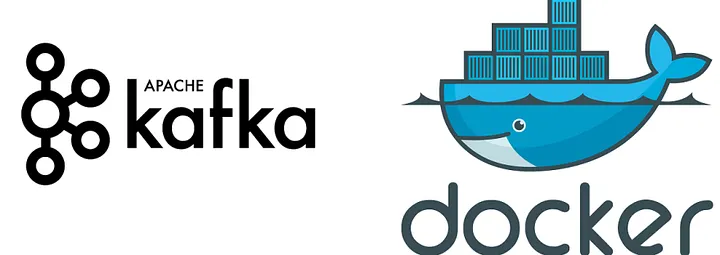
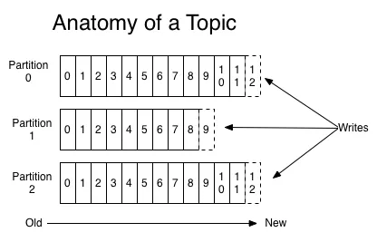
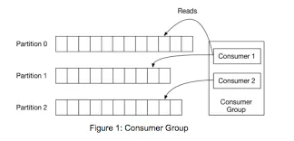

## A Setting up a Apache Kafka using docker with Python 




### Understanding Kafka

Before the hands-on, let’s understand how Kafka works and why it’s so different from other solutions.
Kafka is a publish-subscribe messaging platform that could (normally) have many producers feeding data in it, while consumers are receiving that data. Ok, but there’s a lot of similar applications doing the same thing, why use Kafka?
That’s simple. Kafka can handle trillions of messages a day, and in the big data world, that everything is generating data, a platform that handles data of this magnitude is vital.
- **Real-Time** Data Processing: Data flows through Kafka almost instantly, making it perfect for live data streams.
- **Reliable and Scalable**: Kafka can handle millions of data messages every second, which makes it great for both small and large systems.
- **Fault-Tolerant**: If something goes wrong, Kafka won’t lose your data – it’s designed to recover and keep things moving.
- **Decouples Systems**: Kafka allows systems to send and receive data without needing to know too much about each other, which keeps everything flexible.


Now we will see a few concepts that will be important for the understanding of this material.

#### Producer
Is every application that publishes data to a Kafka topic

#### Consumer
Is every application that subscribes to a Kafka topic to receive data from this.

#### Broker
A Kafka broker is a node in a cluster that hosts partitions.

#### Topic
A topic is a category or feed name to which records are published. Topics in Kafka are always multi-subscriber; that is, a topic can have zero, one, or many consumer groups that subscribe to the data written to it.

#### Partitions
Kafka topics are divided into partitions. Each message in a partition has an offset that is used to order them into the partition. Partitions are really important because this enables to distribute a topic in different servers and creates replicas.

<p align="center">
  
</p>

So when a partition receives a new message, it will create a new offset to index it. On the other side, when a consumer confirms that received a message from a given partition, the Kafka broker updates the last offset consumed in this partition by this consumer, thereat Kafka knows the last message consumed in each partition for a given consumer group avoiding duplicity.

#### Replicas
Replicas are partitions copies for fault tolerance, it means that if one broker is down and will have multiple replicas, no data will be lost, because Kafka will use another replica for each partition, that has the same data of the first one.

#### ConsumerGroup
Each consumer has a consumer group ID, that means that each message from a topic will be delivered to only one consumer in a certain consumer group. To assure this, Kafka only allows that one consumer for each group can consume from a certain partition. This means that if a consumer group has more consumers than the topic has partitions, will have consumers idle in this consumer group.

<p align="center">
  
</p>

---

## Setting Up Kafka in KRaft Mode Using Docker
Now that we have a basic understanding, let’s set up Kafka in KRaft mode using Docker. If you’re not familiar with Docker, don’t worry! It’s a tool that lets us run programs in containers, which are like isolated environments, without needing to install everything directly on our computer.                                                    
**Apache Kafka Quickstart:** [This site](https://kafka.apache.org/quickstart) will guide you through setting up Apache Kafka in KRaft mode using Docker.


### Requirements
- #### Install Docker
   Make sure you have the latest versions of **[Docker](https://docs.docker.com/engine/install/)** installed on your machine.
   Make sure to [add your user to the `docker` group](https://docs.docker.com/install/linux/linux-postinstall/#manage-docker-as-a-non-root-user) when using Linux.

*Note*: that the ``Docker`` version must be >= 20.10.4.
The prior Docker versions may cause permission errors when running the Kafka container, as they do not correctly set directory permissions when creating container paths like /opt/kafka/config.
If you are using the prior version, you may encounter the following error during container startup:
``` bash
===> User
uid=1000(appuser) gid=1000(appuser) groups=1000(appuser)
===> Setting default values of environment variables if not already set.
===> Configuring …
Running in KRaft mode…
/opt/kafka/config/ file not writable
```
To avoid this, please upgrade Docker to 20.10.4 or later.


- ##### Clone this repository
   Clone this repository or copy the files from this repository into a new folder. 

```plaintext
  kafka/
├── docker-compose.yml
├── producer/
│ ├── Dockerfile
│ └── producer.py
| └── requirements.txt   
├── consumer/
│ ├── Dockerfile
│ └── consumer.py
| └── requirements.txt 
```

### Project Structure

- A **Kafka broker** in KRaft (no ZooKeeper) mode
- A **Kafka UI** for visualizing and managing Kafka
- A custom **Producer** written in Python (or your language)
- A custom **Consumer** written in Python (or your language)

### The Docker Compose file

```bash
services:

 kafka:
  image: apache/kafka:latest
  container_name: kafka
  ports:
    - "9092:9092"
  volumes:
   - ./data:/kafka/kraft-combined-logs
  environment:
    KAFKA_NODE_ID: 1
    KAFKA_PROCESS_ROLES: controller,broker
    KAFKA_CONTROLLER_QUORUM_VOTERS: 1@localhost:9093
    KAFKA_LISTENERS: PLAINTEXT://0.0.0.0:9092,CONTROLLER://0.0.0.0:9093
    KAFKA_LISTENER_SECURITY_PROTOCOL_MAP: CONTROLLER:PLAINTEXT,PLAINTEXT:PLAINTEXT
    KAFKA_CONTROLLER_LISTENER_NAMES: CONTROLLER
    KAFKA_INTER_BROKER_LISTENER_NAME: PLAINTEXT
    KAFKA_ADVERTISED_LISTENERS: PLAINTEXT://kafka:9092
    KAFKA_OFFSETS_TOPIC_REPLICATION_FACTOR: 1
    KAFKA_GROUP_INITIAL_REBALANCE_DELAY_MS: 0
    KAFKA_TRANSACTION_STATE_LOG_MIN_ISR: 1
    KAFKA_TRANSACTION_STATE_LOG_REPLICATION_FACTOR: 1
    KAFKA_LOG_DIRS: /tmp/kafka-logs
    command: >
     bash -c "if [ ! -f /kafka/kraft-combined-logs/meta.properties ]; then
     /opt/kafka/bin/kafka-storage.sh format -t Mk3OEYBSD34fcwNTJENDM2Qk -c /opt/kafka/config/kraft/server.properties --ignore-formatted --standalone;
     fi &&
     /opt/kafka/bin/kafka-server-start.sh /opt/kafka/config/kraft/server.properties"
  networks:
      - kafka-net

 
 kafka-ui:
    image: provectuslabs/kafka-ui:latest
    container_name: kafka-ui
    ports:
      - "8080:8080"
    environment:
      KAFKA_CLUSTERS_0_NAME: kafka-local
      KAFKA_CLUSTERS_0_BOOTSTRAPSERVERS: kafka:9092
    depends_on:
      - kafka
    networks:
      - kafka-net

 producer:
    restart: on-failure
    image : producer:kafka
    build:
      context: ./producer
    stdin_open: true    
    tty: true
    container_name: producer
    environment:
      KAFKA_BOOTSTRAP_SERVERS: kafka:9092
    depends_on:
      - kafka
    networks:
      - kafka-net

 consumer:
    restart: on-failure
    image: consumer:kafka
    container_name: consumer
    environment:
      KAFKA_BOOTSTRAP_SERVERS: kafka:9092
    build:
      context: ./consumer
    depends_on:
      - kafka
    networks:
      - kafka-net

volumes:
  data:

networks:
  kafka-net:

```

 **notice** that there is only Kafka services to deploy, no need for Zookeeper anymore ( It’s important to mention that Zookeeper is planned to be removed in Apache Kafka 4.0).

If we use Kafka in KRaft mode, we do not need to use ZooKeeper for cluster coordination or storing metadata. Kafka coordinates the cluster itself using brokers that act as controllers. Kafka also stores the metadata used to track the status of brokers and partitions.

#### 1- Starting the Kafka Server

We’ll start the Kafka server using Kafka Raft (KRaft). First, we need to generate a cluster identifier using the **kafka-storage.sh** script:

```bash
command: >
     bash -c "if [ ! -f /kafka/kraft-combined-logs/meta.properties ]; then
     /opt/kafka/bin/kafka-storage.sh format -t Mk3OEYBSD34fcwNTJENDM2Qk -c /opt/kafka/config/kraft/server.properties --ignore-formatted --standalone;
     fi &&
     /opt/kafka/bin/kafka-server-start.sh /opt/kafka/config/kraft/server.properties"

```
This ``command`` block in the ``docker-compose.yml`` ensures that Kafka is **only formatted** once and then **started properly** using the KRaft (Kafka Raft) mode, without ZooKeeper.
- This checks whether Kafka has already been formatted by verifying if the   meta.properties file exists.

- If the file is missing, it means Kafka hasn't been formatted yet.
- This command formats Kafka storage using the given Cluster ID.

- ``--ignore-formatted``: Ignores formatting errors if already formatted.

- ``--standalone``: Tells Kafka to use KRaft mode (no ZooKeeper).
- Once the formatting is done (or skipped if already done), it starts the Kafka broker using the provided config file.


